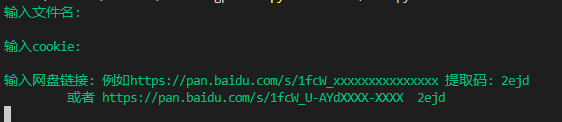

# BaiduFilesTransfers_Pro
------------------------------------------
###### 百度网盘批量转存工具

​	超过500转存限制后，逐个保存子文件夹文件

`python3  BaiduFilesTransfers_Pro.py`

`文件名`   --指本人网盘转存的文件夹名（默认根路径 /）

`cookie`  --网盘登录的cookie

`网盘链接`  --格式如  					

- https://pan.baidu.com/s/XXX_XXXX-XXXXXXX提取码: 2ejd
-   https://pan.baidu.com/s/XXX_XXXX-XXXXXXX    2ejd

#### 01 来源介绍
--------------------------------------------------------
某日看到某云盘资料多，随上同性交友网站寻求转存脚本

得一老哥脚本 
# BaiduPanFilesTransfers（https://github.com/hxz393/BaiduPanFilesTransfers）
有会员转存歧视

遂据老哥脚本改了改，遵循够用就行原理

#### 02 接前文cookie
---------------------------------------------
###### Cookie    F12  找到cookie  复制

#### 02 后言
--------------------------------------------
或许会升级，前提是有时间或者需要用到        -  -
有些许bug  偶尔一直转存不了 没用到不细究，可提issues
